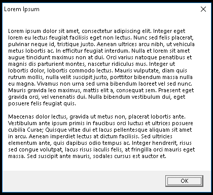

# simple_message_box [](https://travis-ci.com/rukai/simple-message-box) [](https://ci.appveyor.com/project/rukai/simple-message-box) [](https://crates.io/crates/simple-message-box)

Create a native message box for any platform:
```
simple_message_box::create_message_box("Hello, World!", "Some Title");
```

Currently supports Windows and X11, looking for macOS and wayland support.

## Windows


## macOS

TODO

## X11


## Wayland

TODO
